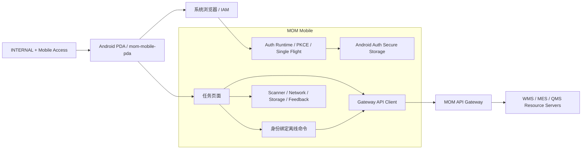

<div align="center">

# MOM Mobile

### 面向新能源材料制造现场的工业 PDA 客户端

以扫码为主要输入，以任务为操作入口，以身份绑定离线命令保障弱网连续作业，覆盖原料收货、上架、生产领退料、成品入库与发运确认。

<p>
  <a href="https://github.com/Chris-co-shi/mom-mobile/actions/workflows/ci.yml">
    
  </a>
  
  
  
</p>

[文档中心](docs/README.md) · [P1.5 Mobile 运行时](docs/architecture/P1.5-Mobile认证授权运行时基线.md) · [P1.5 Mobile 计划](docs/plans/P1.5-Mobile认证授权实施计划.md) · [离线同步](docs/architecture/离线命令队列与同步.md) · [ADR](docs/adr/README.md)

</div>

---

> [!IMPORTANT]
> P1.5 Mobile Auth Runtime 已完成并合并：系统浏览器 OAuth/OIDC、PKCE、内存 Access Token、Android Keystore Adapter Contract、Session 恢复、Gateway `/api/iam/me` 与离线身份门禁均已交付。Android Keystore、HTTPS App Link 与真机强杀恢复是 Phase 02 正式 Mobile 联调前置验收项。

## 🌟 项目定位

`MOM Mobile` 是内部现场人员使用的 Android 工业 PDA 客户端，不是桌面管理端缩小版，也不是供应商/客户门户。

V1 重点验证：

- 扫码驱动的现场任务。
- 系统浏览器安全登录与 App Link 回调。
- 弱网、断网、进程回收和前后台恢复。
- 身份绑定离线命令、幂等、冲突和结果未知。
- Scanner、Network、Storage、Auth Secure Storage 与厂商 SDK 适配边界。
- Android 产品构建和 H5 开发验证的分离。

## 🔐 P1.5 Mobile 安全基线

- Client：`mom-mobile-pda`。
- 只允许具有 Mobile Access 的 `INTERNAL` 用户。
- 使用系统浏览器，不在嵌入式 WebView 输入账号密码。
- Authorization Code + PKCE `S256` + OpenID Connect。
- 正式环境优先 HTTPS App Link。
- Access Token 只存在内存。
- Refresh Token 使用 Android 安全存储 Adapter。
- PKCE 临时事务必须承受 App 进程被回收。
- 冷启动优先 Refresh 恢复 Session。
- 同一 App 实例使用 Single Flight Refresh；每请求最多自动重试一次；403 不刷新。
- Refresh 本地替换结果不确定时，旧 Token 不得再次使用。
- `/api/iam/me` 是正式 Mobile Access Context 来源。
- `X-Factory-Id` 只是工作上下文，不是授权证明。
- H5 只用于开发调试，不持久化真实 Refresh Token。

完整规则见 [P1.5 Mobile 认证与授权运行时基线](docs/architecture/P1.5-Mobile认证授权运行时基线.md)。

## 📴 离线命令安全归属

每条正式离线命令必须记录：

- 创建用户 `user_id`
- 创建 Session `sid`
- Client `mom-mobile-pda`
- `factory_id`
- `party_type`、`party_id`
- 所需 Permission Code
- 创建时间
- 幂等键、Correlation ID、Schema 版本和命令类型

用户 A 的命令不能由用户 B 自动同步。原 Session 到期或撤销后，新 Session 不能静默继承命令；必须按后端契约显式复核。Token 不进入离线命令。

## 🧭 移动端系统全景



## 📱 当前页面骨架

| 页面 | 当前运行时状态 | Phase 02 目标 |
|---|---|---|
| 首页工作台 | 已有骨架 | 基于 `/api/iam/me` 和 Permission 展示待办 |
| 原料收货 | 已有骨架 | 扫码、Factory/Permission 与离线命令归属 |
| 上架确认 | 不进入当前运行时导航 | 收货链契约冻结后启用 |
| 生产领料 | 后续阶段，运行时禁用 | Phase 03 实现 |
| 发运确认 | 后续阶段，运行时禁用 | Phase 03 实现 |
| 离线队列 | 已有骨架 | user/sid/client/factory/party/permission、冲突和人工处理 |
| 生产退料 | 待设计 | 退料原因、数量和容器确认 |
| 成品入库 | 待设计 | 成品容器、质量状态与库位 |

## 🧩 模块边界

```text
src/
├── pages/             # 页面交互与业务编排
├── components/        # 通用移动端展示组件
├── api/               # 仅访问 MOM Gateway
├── platform/          # 扫码、网络、普通存储、Auth 安全存储等适配器
├── offline/           # 离线命令、持久化、同步与冲突
├── idempotency/       # 幂等键与请求标识
├── stores/            # 内存会话与应用状态，不持久化 Token
└── locales/
```

### 强制规则

- 页面不直接调用 `uni.scanCode`、本地存储、系统浏览器、原生安全存储或厂商 SDK。
- 所有业务后端访问统一通过 MOM Gateway。
- Gateway 不是最终授权边界，业务服务执行 Permission、Factory/Party 和对象归属校验。
- 离线写操作保存业务命令，不缓存 HTTP 请求后盲目重放。
- 关键操作超时进入结果未知，不简单显示失败。
- H5 不被描述为正式 Android 安全实现。

## 🛠️ 技术基线

| 层次 | 技术选型 |
|---|---|
| 产品目标 | Android 工业 PDA |
| 开发框架 | uni-app Vue 3 CLI |
| UI 运行时 | Vue 3.4、Pinia 2（不得持久化 Token） |
| 构建工具 | Vite 5.2 |
| 类型系统 | TypeScript 5.8 |
| 包管理 | pnpm 11.7 |
| Node.js | 22.x |
| CI 验证目标 | H5（非正式 Auth 安全验收） |
| 正式登录 | 系统浏览器 + PKCE S256 + OIDC + HTTPS App Link |
| Token | Access 仅内存；Refresh 仅 Android 安全存储 Adapter |

## 🚀 快速开始

```bash
corepack enable
pnpm install --frozen-lockfile
pnpm dev:h5
```

质量检查：

```bash
pnpm validate
pnpm type-check
pnpm test:auth
pnpm build:h5
```

或：

```bash
pnpm check
```

> H5 用于确定性 CI、交互评审和快速联调。它不持久化真实 Refresh Token，也不能替代 Android App Link 与安全存储真机验收。

## 📚 文档导航

| 分类 | 文档 | 说明 |
|---|---|---|
| 总览 | [文档中心](docs/README.md) | 全部移动端文档入口 |
| 安全 | [P1.5 Mobile Runtime](docs/architecture/P1.5-Mobile认证授权运行时基线.md) | 系统浏览器、App Link、Token、恢复和离线归属 |
| 计划 | [P1.5 Mobile 计划](docs/plans/P1.5-Mobile认证授权实施计划.md) | S11、S12 实施与验收 |
| 架构 | [移动端总体架构](docs/architecture/移动端总体架构.md) | Auth、页面、API、Offline 和 Adapter |
| 架构 | [认证与工厂范围](docs/architecture/认证权限与工厂范围.md) | Client、Mobile Access、Permission 和 Factory |
| 架构 | [本地存储与安全](docs/architecture/本地存储与数据安全.md) | Auth Secure Storage、PKCE Storage 和普通 Storage |
| 架构 | [离线同步](docs/architecture/离线命令队列与同步.md) | 身份绑定命令、状态和恢复策略 |
| 决策 | [ADR 索引](docs/adr/README.md) | 移动端关键架构决策 |

## 🗺️ 当前路线图

| 阶段 | 目标 | 状态 |
|---|---|---|
| Mobile Phase 01 | App、页面、Adapter、API Client、离线队列基础 | ✅ 基础完成 |
| P1.5 S00 | Mobile 认证授权设计对齐 | ✅ 已完成 |
| P1.5 S11 | Mobile Auth Runtime | ✅ Completed / Merged |
| P1.5 S12 | Mobile 安全 E2E 与封板 | ✅ Completed / Merged |
| Phase 02 | 收货链与真机正式联调 | ⏳ Pending / Ready after preflight cleanup |

## 🧠 移动端原则

1. **系统浏览器登录**：账号密码不进入嵌入式 WebView。
2. **Token 分层**：Access 内存，Refresh Android 安全存储。
3. **身份绑定离线命令**：不跨用户、Session 或 Factory 静默同步。
4. **服务端授权为准**：前端与 Gateway 不替代业务服务最终授权。
5. **弱网可恢复**：断网不丢操作，恢复不盲目重放。
6. **平台隔离**：页面不感知 uni-app API、Auth 安全存储或厂商 SDK。
7. **H5 有边界**：只用于开发调试和 CI。
8. **原型先行**：没有竖屏原型和状态矩阵，不进入正式业务实现。

---

<div align="center">

**MOM Mobile — 让工业现场操作在认证、扫码、弱网和设备差异下仍然可靠。**

</div>
