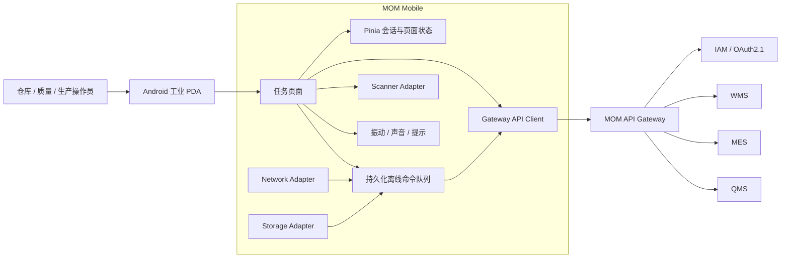

<div align="center">

# MOM Mobile

### 面向新能源材料制造现场的工业 PDA 客户端

以扫码为主要输入，以任务为操作入口，以离线命令队列保障弱网连续作业，覆盖原料收货、上架、生产领退料、成品入库与发运确认。

<p>
  <a href="https://github.com/Chris-co-shi/mom-mobile/actions/workflows/ci.yml">
    
  </a>
  
  
  
  
  
  
</p>

[文档中心](docs/README.md) · [V1 页面需求](docs/requirements/V1页面需求.md) · [移动端架构](docs/architecture/移动端总体架构.md) · [离线同步](docs/architecture/离线命令队列与同步.md) · [ADR](docs/adr/README.md)

</div>

---

> [!IMPORTANT]
> 当前仓库已经具备可运行的 uni-app Vue 3 应用骨架、H5 构建、扫码/网络/存储适配器、离线命令入队和基础 PDA 页面；尚未完成真实 Android PDA SDK、后台同步 Worker、完整冲突处理、OAuth 登录和正式业务闭环。

> [!NOTE]
> 本仓库所有文档新增、修改、重命名、原型和 ADR 更新统一在 `agent/complete-chinese-docs` 分支完成，再通过 PR 合并到 `main`。

## 🌟 项目定位

`MOM Mobile` 是工业 MOM 项目的现场作业终端，不是桌面管理端的缩小版。它面向仓库、质量和生产现场，以大按钮、少输入、强反馈、可恢复为基本交互原则。

V1 重点验证以下工程能力：

- 条码、二维码和 Data Matrix 扫描驱动的任务执行。
- 送货单、容器、物料、批次和库位的连续扫码校验。
- 弱网、断网和网络抖动下的可持续作业。
- 持久化离线命令、幂等键、关联 ID 和恢复操作。
- 冲突、重复提交、服务端状态变化和结果未知的处理。
- 页面、扫描器、网络、存储和未来厂商 SDK 的适配边界。
- Android PDA 产品构建与 H5 可重复 CI 验证的分离。

## 🔄 V1 现场业务闭环

```text
供应商送货任务
      ↓
扫描送货单 / 物料 / 容器
      ↓
收货称重与待检批次建立
      ↓
来料检验交接
      ↓
扫描容器 + 库位完成上架
      ↓
生产领料 / 退料
      ↓
成品容器入库
      ↓
发运装车确认
      ↓
离线队列、冲突处理与人工恢复
```

## 🧭 移动端系统全景



## 📱 当前页面骨架

| 页面 | 当前状态 | V1 目标 |
|---|---|---|
| 首页工作台 | 已有骨架 | 按角色展示待办和快捷任务 |
| 原料收货 | 已有骨架 | 送货单、容器、称重、待检批次 |
| 上架确认 | 已有骨架 | 容器与库位双扫描 |
| 生产领料 | 已有骨架 | 工单、物料、批次和数量确认 |
| 发运确认 | 已有骨架 | 发运单、托盘/容器和装车确认 |
| 离线队列 | 已有骨架 | 状态、重试、冲突和人工处理 |
| 生产退料 | 待设计 | 退料原因、数量和容器确认 |
| 成品入库 | 待设计 | 成品容器、质量状态与库位 |

## 🧩 模块边界

```text
src/
├── pages/             # 页面交互与业务编排
├── components/        # 通用移动端展示组件
├── api/               # 仅访问 MOM Gateway
├── platform/          # 扫描、网络、存储、振动等平台适配器
├── offline/           # 离线命令、持久化、同步与冲突
├── idempotency/       # 幂等键与请求标识生成
├── stores/            # 会话与应用内状态
└── locales/           # 后续国际化资源
```

### 强制规则

- 页面不得直接调用 `uni.scanCode`、本地存储或厂商 SDK。
- 页面不得直接拼接 IAM、MES、WMS、QMS 服务地址。
- 所有后端访问统一通过 MOM Gateway。
- 离线写操作保存为业务命令，不缓存 HTTP 响应后重放。
- 每条离线命令必须携带幂等键、关联 ID、创建时间和状态。
- 关键操作超时后不得简单显示失败，必须进入“结果未知”并允许查询最终状态。
- 正式页面必须先完成用户流程、竖屏原型、状态矩阵、组件映射和 API 映射。

## 🛠️ 技术基线

| 层次 | 技术选型 |
|---|---|
| 产品目标 | Android 工业 PDA |
| 开发框架 | uni-app Vue 3 CLI |
| UI 运行时 | Vue 3.4、Pinia 2 |
| 构建工具 | Vite 5.2 |
| 类型系统 | TypeScript 5.8 |
| 包管理 | pnpm 11.7 |
| Node.js | 22.x |
| CI 验证目标 | H5 |
| 扫码基线 | `uni.scanCode`，后续可替换厂商 SDK |
| 网络与存储 | uni-app API，经平台适配器封装 |

> 具体版本以 `package.json` 和 `pnpm-lock.yaml` 为唯一权威来源。所有 DCloud 运行包必须使用匹配的发行标识，禁止混用版本。

## 🚀 快速开始

### 环境要求

- Node.js 22.x
- pnpm 11.7+
- Git

```bash
corepack enable
pnpm install --frozen-lockfile
pnpm dev:h5
```

### 质量检查

```bash
pnpm validate
pnpm type-check
pnpm build:h5
```

或执行完整检查：

```bash
pnpm check
```

> H5 用于确定性 CI、交互评审和快速联调；最终产品目标是 Android PDA。真实设备打包将在扫描硬件、设备厂商 SDK、签名和发布策略确定后接入。

## 📴 离线命令原则

```text
用户提交业务操作
      ↓
生成 idempotencyKey + correlationId
      ↓
网络可用？ ── 是 ──→ 调用 Gateway
      │                    ↓
      否               成功 / 冲突 / 结果未知
      ↓
持久化业务命令
      ↓
网络恢复后同步
      ↓
服务端幂等判定
      ↓
完成 / 冲突 / 人工处理
```

当前已实现基础命令入队、持久化列表和手工重试骨架；自动同步、退避、服务端快照对比和冲突处置将在后续 Slice 完成。

## 📚 文档导航

| 分类 | 文档 | 说明 |
|---|---|---|
| 总览 | [文档中心](docs/README.md) | 全部移动端文档入口 |
| 需求 | [移动端产品范围](docs/requirements/移动端产品范围.md) | PDA 的职责与非职责 |
| 需求 | [V1 页面需求](docs/requirements/V1页面需求.md) | 编号化页面与操作需求 |
| 需求 | [非功能需求](docs/requirements/移动端非功能需求.md) | 弱网、安全、性能与设备要求 |
| 计划 | [V1 路线图](docs/plans/V1移动端路线图.md) | 阶段和交付目标 |
| 计划 | [Phase 01](docs/plans/Phase-01-移动端骨架计划.md) | 当前技术骨架实施计划 |
| 架构 | [移动端总体架构](docs/architecture/移动端总体架构.md) | 页面、平台与服务关系 |
| 架构 | [离线同步](docs/architecture/离线命令队列与同步.md) | 命令状态和恢复策略 |
| 架构 | [扫描与设备](docs/architecture/扫描与设备适配.md) | 扫描器和厂商 SDK 边界 |
| 设计 | [移动端原型](docs/prototypes/README.md) | 竖屏原型和状态要求 |
| 测试 | [移动端测试策略](docs/testing/移动端测试策略.md) | H5、真机和故障测试 |
| 发布 | [Android 构建发布](docs/release/Android构建发布与签名.md) | 签名、渠道、升级和回滚 |
| 决策 | [ADR 索引](docs/adr/README.md) | 移动端关键架构决策 |

## 🗺️ 当前路线图

| 阶段 | 目标 | 状态 |
|---|---|---|
| Mobile Phase 01 | App 骨架、适配器、API Client、离线队列基础 | 🚧 进行中 |
| Mobile Phase 02 | 收货、上架、领退料原型与接口闭环 | ⏳ 计划中 |
| Mobile Phase 03 | 成品入库、发运、自动同步与冲突处理 | ⏳ 计划中 |
| Mobile Phase 04 | 真机 SDK、签名发布、弱网与故障演练 | ⏳ 计划中 |

## 🔗 MOM 项目仓库族

| 仓库 | 职责 |
|---|---|
| `mom-platform` | MOM 后端平台与工业领域内核 |
| `mom-web` | 管理端、供应商门户与客户门户 |
| `mom-mobile` | Android PDA、扫码与离线作业 |
| `pcs-platform` | 生产设备协同与协议适配 |
| `wcs-platform` | 自动仓储调度与设备恢复 |
| `erp-simulator` | ERP/SAP 接口与异常模拟 |
| `mom-infra` | k3s、中间件、观测和部署脚本 |

## 🧠 移动端原则

1. **任务优先**：操作员进入系统后先看到待办，而不是模块菜单。
2. **扫码优先**：可扫描的信息不要求手工输入。
3. **反馈明确**：成功、警告、冲突和设备错误必须视觉与触觉可区分。
4. **弱网可恢复**：断网不等于丢操作，恢复也不等于盲目重放。
5. **幂等双保险**：客户端生成幂等键，服务端仍必须执行幂等校验。
6. **平台隔离**：页面不感知 uni-app API 或厂商 PDA SDK。
7. **数据最小化**：本地只保留作业必需数据，敏感数据需加密或避免落盘。
8. **原型先行**：没有竖屏原型和状态矩阵，不进入正式实现。

---

<div align="center">

**MOM Mobile — 让工业现场操作在扫码、弱网和设备差异下仍然可靠。**

</div>
