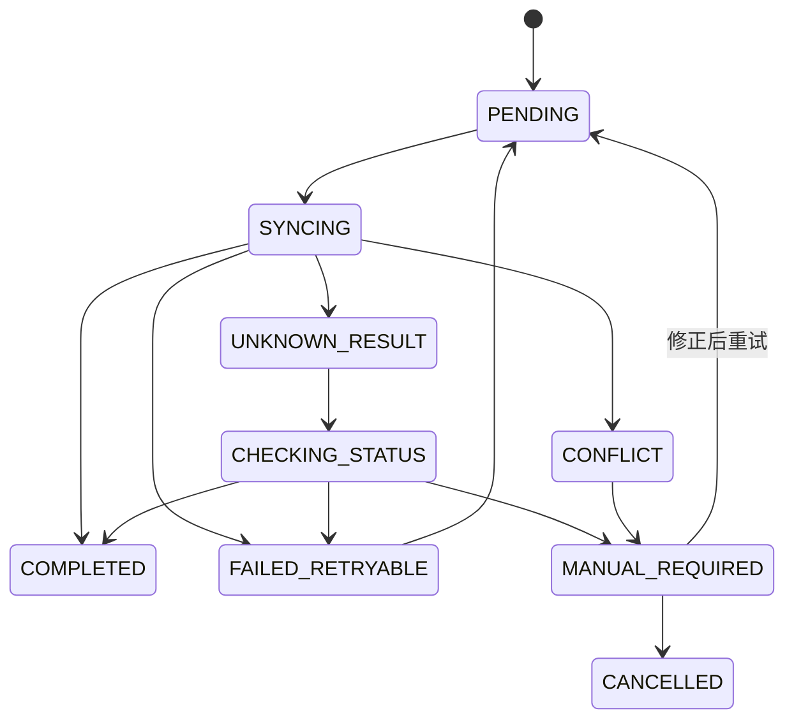

# 离线命令队列与同步

## 1. 目标

离线能力用于处理短时断网、网络抖动和请求结果未知，不用于把 PDA 变成独立业务系统。

## 2. 命令而不是请求缓存

离线队列保存业务意图：

```text
确认收货
确认上架
确认领料
确认退料
确认成品入库
确认发运
```

不得仅保存任意 URL 和原始 HTTP 请求后无限重放。正式模型应包含明确的 `commandType`、Schema 版本和业务键。

## 3. 命令模型

建议字段：

```text
id
commandType
schemaVersion
endpoint
method
payload
idempotencyKey
correlationId
factoryId
userId
createdAt
updatedAt
attempts
nextAttemptAt
status
lastErrorCode
lastErrorMessage
serverSnapshot
```

Token 不进入命令载荷。

## 4. 状态机



当前代码仅包含 `PENDING`、`SYNCING`、`FAILED` 基础状态，目标状态需要后续 Slice 扩展。

## 5. 离线资格

每类命令必须配置：

- 是否允许离线创建。
- 最大离线时长。
- 需要的本地前置数据。
- 同步前重新校验规则。
- 冲突处理方式。

高风险或强实时命令可明确禁止离线。

## 6. 同步触发

- 网络恢复并通过 Gateway 健康检查。
- 用户手动同步。
- 应用启动后的受控检查。
- 页面提交在线失败且错误符合离线资格。

不得因为网络状态显示在线就立即并发重放全部命令。

## 7. 同步顺序

- 单命令必须加同步锁。
- 同一业务对象相关命令应按创建顺序处理。
- 可设置小并发，但必须避免同一容器、批次、工单并发写入。
- 后续命令依赖前序结果时必须建立依赖关系。

## 8. 重试

只自动重试明确可重试错误：

- 网络不可达。
- 连接超时。
- 部分 5xx。
- 429，并遵循服务端 Retry-After。

不自动重试：

- 400 参数错误。
- 401 会话失效。
- 403 无权限。
- 409 业务冲突。
- 业务规则拒绝。

采用指数退避、抖动和最大尝试次数。

## 9. 结果未知

请求超时或连接中断时，服务端可能已成功执行。此时：

1. 保留原幂等键。
2. 状态变为 `UNKNOWN_RESULT`。
3. 调用命令状态或业务结果查询接口。
4. 查询到成功则完成。
5. 无法确认时转人工处理。

禁止重新生成幂等键直接提交。

## 10. 冲突

冲突页面应展示：

- 本地命令摘要。
- 服务端当前对象状态。
- 冲突原因。
- 允许动作：刷新、修正、取消、转人工。

不得自动用本地值覆盖服务端。

## 11. 用户和会话

- 命令记录创建用户和工厂。
- 切换账号后不得用新用户 Token 自动执行旧用户命令。
- 应提示原用户登录处理或由主管转交。
- 权限在同步时由服务端重新校验。

## 12. 数据迁移

命令必须携带 Schema 版本。应用升级时：

- 兼容读取旧命令。
- 提供迁移或人工处理策略。
- 不得因升级直接清空队列。

## 13. 验收场景

- 断网入队后重启，命令仍存在。
- 网络恢复后只执行一次。
- 同一命令提交三次，服务端业务只执行一次。
- 409 进入冲突而非无限重试。
- 超时进入结果未知并查询最终状态。
- 切换账号不自动执行旧账号命令。
- 应用升级后旧命令仍可读取。
