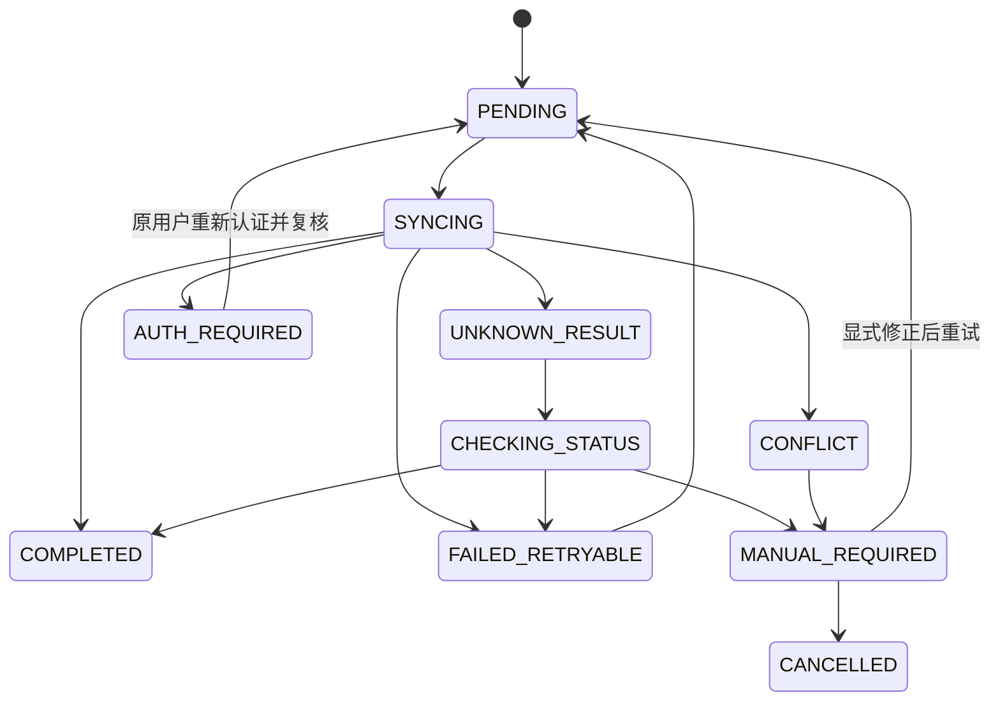

# 离线命令队列与同步

- 当前阶段：`P1.5：认证与授权闭环`
- Auth Runtime：[P1.5 Mobile 认证与授权运行时基线](P1.5-Mobile认证授权运行时基线.md)

## 1. 目标

离线能力处理短时断网、网络抖动和结果未知，不把 PDA 变成独立业务系统。离线命令必须绑定创建时身份、安全 Session、Client、Factory、Party 和 Permission。

## 2. 命令而不是 HTTP 缓存

离线队列保存明确业务意图，例如确认收货、上架、领退料、成品入库和发运。

不得只保存任意 URL 和原始 HTTP 请求后无限重放。Token、Authorization Header 和 Refresh Token 不进入命令载荷。

## 3. 正式命令模型

至少包含：

```text
id
commandType
schemaVersion
payload
idempotencyKey
correlationId
userId
sessionId / sid
clientId
factoryId
partyType
partyId
requiredPermission
createdAt
updatedAt
attempts
nextAttemptAt
status
lastErrorCode
lastErrorMessage
serverSnapshot
```

固定约束：

- `clientId = mom-mobile-pda`。
- `userId` 是创建命令的内部用户。
- `sessionId` 记录创建时用户授权 Session。
- `factoryId` 是创建时工作上下文。
- `partyType`、`partyId` 即使为空也显式记录。
- `requiredPermission` 使用 `domain:resource:action`。

## 4. 状态机



当前代码只有基础状态；正式状态在后续业务/认证 Slice 实现。

## 5. 同步前安全门禁

每条命令同步前必须验证：

1. 当前用户等于 `userId`。
2. 当前 Client 为 `mom-mobile-pda`。
3. 当前 Session 已通过恢复或重新认证；不得用用户 B Session 执行用户 A 命令。
4. 当前 `/api/iam/me` 仍包含 `factoryId`。
5. 当前用户仍有 `requiredPermission`。
6. Party 上下文与创建时一致。
7. Mobile Access 仍有效。
8. 命令未超过业务允许的离线时长。

客户端门禁只防止明显错误；服务端仍执行 Token、Permission、Factory/Party、对象归属、领域状态和幂等最终校验。

## 6. Session 变化

- Access Token 刷新但 `sid` 未变化：可在重新校验后继续。
- 原 Session 到期/撤销，原用户重新登录获得新 `sid`：命令不能自动静默继承；必须按命令风险和后端契约显式复核后继续。
- 用户切换：其他用户命令进入 `AUTH_REQUIRED` 或冻结状态。
- Mobile Access 关闭：停止自动同步。
- 设备丢失：停止同步并等待受控处置。

## 7. Factory 与 Party

- 切换 Factory 后不得自动执行原 Factory 命令。
- `X-Factory-Id` 只表示同步时工作上下文，不是授权证明。
- 客户端不能修改 `partyId` 以适配当前会话。
- 内部代办若未来支持，必须使用后端受控代表上下文和独立 Permission，不能本地改写命令身份。

## 8. 同步触发与锁

触发条件：

- 网络恢复并通过 Gateway 健康检查。
- 用户手动同步。
- App 启动/回前台后的受控检查。
- 在线提交失败且错误符合离线资格。

要求：

- 先完成 Session 恢复和 `/api/iam/me`。
- 同一时间只允许一个 Auth Refresh Flight。
- 单命令有同步锁。
- 同一对象命令按创建顺序处理。
- 不因网络显示在线就并发重放全部命令。

## 9. 重试

可自动重试：

- 明确网络不可达。
- 连接超时。
- 允许重试的 5xx。
- 429，并遵循 `Retry-After`。

不自动重试：

- 400 参数错误。
- 401 且 Session 恢复失败。
- 403 无权限或 Mobile Access 关闭。
- 404 对象不存在或不可访问。
- 409 冲突。
- 业务规则拒绝。
- Refresh Token 本地替换结果不确定。

采用指数退避、抖动和最大尝试次数。

## 10. 结果未知

业务命令请求超时或断线时：

1. 保留原幂等键。
2. 状态变为 `UNKNOWN_RESULT`。
3. 使用命令状态或业务结果查询接口。
4. 查询成功则完成。
5. 无法确认则转人工处理。

禁止生成新幂等键直接重提。

Refresh Token 请求的网络不确定不按业务命令查询处理；旧 Token 不得再次使用，进入重新登录或受控恢复。

## 11. 冲突与人工处理

冲突页面展示命令摘要、创建用户/Factory、服务端状态、冲突原因和允许动作。

不得：

- 自动用本地值覆盖服务端。
- 静默改写用户、Session、Factory、Party 或 Permission。
- 用主管当前 Token直接执行其他用户命令。

主管转交若实现，必须调用显式后端 API、检查独立 Permission，并记录完整审计。

## 12. 数据迁移与保留

- 命令携带 Schema 版本。
- 应用升级兼容读取旧命令。
- 新增身份字段时提供确定性迁移或人工处理。
- 无法确定旧命令创建 Session/Party/Permission 时不得猜测补值或自动同步。
- 退出、撤销和升级不得直接清空未完成命令。

## 13. 验收场景

- 断网入队后重启，命令仍存在且身份归属完整。
- 网络恢复后只执行一次。
- 同一命令提交三次，服务端业务只执行一次。
- 409 进入冲突而非无限重试。
- 超时进入结果未知并查询最终状态。
- 用户 B 不自动执行用户 A 命令。
- Factory 切换不自动执行原 Factory 命令。
- Permission/Mobile Access 被移除后停止同步。
- 原 Session 撤销后命令不静默继承新 Session。
- 应用升级后旧命令可迁移或进入人工处理。
