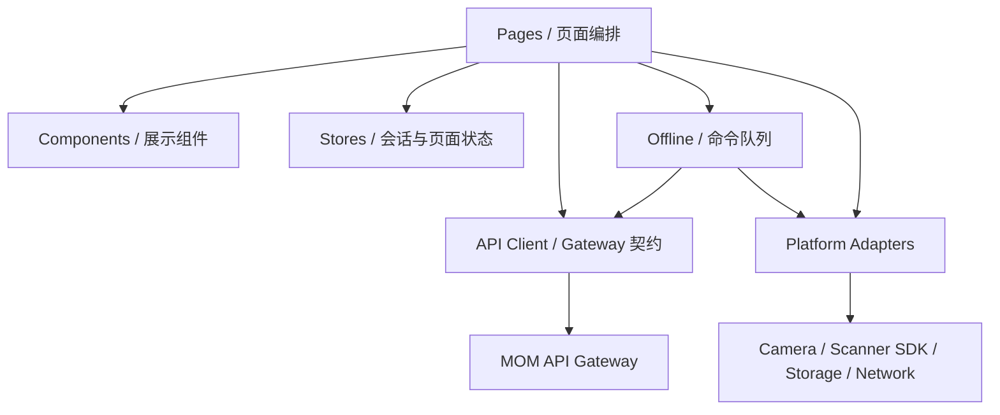

# 移动端总体架构

## 1. 架构目标

移动端架构需要同时解决现场交互、平台差异、弱网、离线恢复、幂等和设备发布问题。

## 2. 分层

## 3. 页面层

负责：

- 页面生命周期。
- 用户输入和流程编排。
- View Model 展示。
- 调用应用服务、API Client 或离线服务。
- 展示状态和恢复动作。

禁止：

- 直接调用厂商 SDK。
- 直接访问本地存储。
- 直接拼接服务地址。
- 自行实现离线重试循环。
- 把 API DTO 直接扩散到全部组件。

## 4. 组件层

组件分为：

- 通用组件：网络徽标、大按钮、状态提示、确认卡片。
- 业务组件：扫描结果卡、容器摘要、库位摘要、离线命令状态。
- 页面专用组件：仅服务单个流程，不急于抽象。

组件应接收 View Model 和事件，不直接调用 API。

## 5. Store

Store 保存：

- 当前会话。
- 当前工厂。
- 网络状态。
- 页面跨步骤的短期状态。
- 当前任务上下文。

不保存：

- 业务权威账本。
- 完整库存或工单数据库。
- Token 之外的大量敏感数据。
- 应由离线仓储持久化的命令。

## 6. API Client

统一负责：

- Gateway Base URL。
- Bearer Token。
- 工厂上下文。
- correlation ID。
- idempotency key。
- 超时与错误标准化。
- 响应 DTO 到边界模型的解析。

## 7. Offline

离线模块负责：

- 命令创建。
- 持久化。
- 状态迁移。
- 同步调度。
- 退避与重试。
- 冲突和结果未知。
- 人工处理。

页面只提交业务命令，不操作底层存储记录。

## 8. Platform Adapter

平台层封装：

- 扫码。
- 网络。
- 存储。
- 振动和声音。
- 设备信息。
- 后续打印机和厂商 SDK。

H5、通用 App 和真实 PDA 可以使用不同实现，但暴露一致接口。

## 9. 运行目标

| 目标 | 用途 |
|---|---|
| H5 | CI、原型评审、快速联调、Fake Adapter |
| Android App | 产品目标和真机作业 |
| 厂商 PDA | 扫描头、广播或 SDK 适配 |

## 10. 架构验证

- 页面代码中不出现未封装的 `uni.scanCode`。
- 页面代码中不直接使用存储 API。
- 所有后端请求经过 API Client。
- 离线命令状态迁移有测试。
- H5 可通过 Fake Adapter 模拟成功、失败和取消。
- 真机 SDK 替换不改变业务页面主流程。
