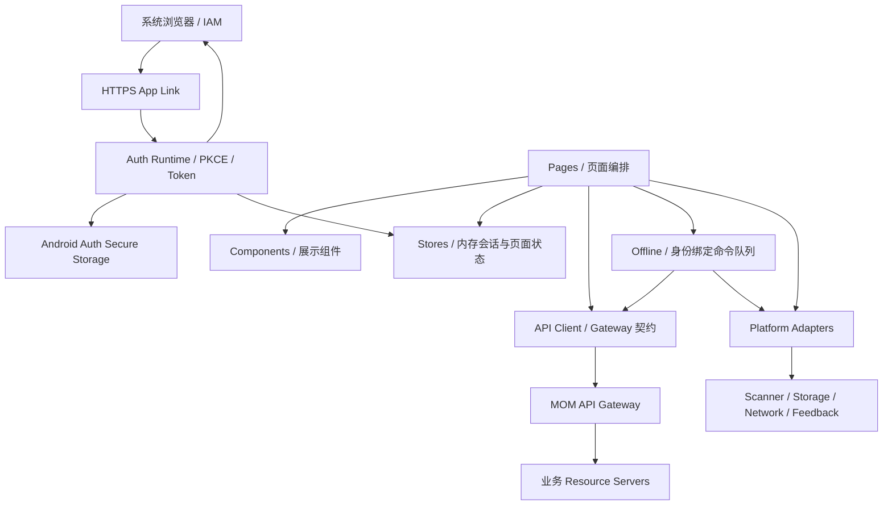

# 移动端总体架构

- 当前阶段：`P1.5：认证与授权闭环`
- Auth Runtime：[P1.5 Mobile 认证与授权运行时基线](P1.5-Mobile认证授权运行时基线.md)

## 1. 架构目标

移动端架构同时解决现场交互、系统浏览器认证、平台差异、弱网、离线恢复、幂等、身份归属和设备发布问题。

## 2. 分层



## 3. Auth Runtime

负责：

- `mom-mobile-pda` Client 配置。
- 系统浏览器 Authorization Code + PKCE S256 + OIDC。
- HTTPS App Link 回调。
- 可恢复的一次性 PKCE 事务。
- 内存 Access Token。
- Android 安全存储 Refresh Token。
- Single Flight Refresh、冷启动和前后台恢复。
- `/api/iam/me` 与 Mobile Access Context。

不负责业务 Permission 最终授权或离线业务状态机。

## 4. 页面层

负责页面生命周期、用户输入、View Model、业务流程、状态和恢复动作。

禁止：

- 直接调用系统浏览器、App Link、原生安全存储或厂商 SDK。
- 直接访问普通本地存储。
- 直接拼接服务地址或 Token。
- 自行实现 Refresh/离线重试循环。
- 把前端权限判断当作安全边界。

## 5. Store

内存 Store 保存：

- 当前 Access Token 和运行时 Auth State。
- 当前用户、Permissions 和 Mobile Access Context。
- 当前 Factory、网络状态和页面短期状态。

不持久化：

- Access Token。
- Refresh Token。
- ID Token 原文。
- 业务权威账本或完整库存/工单数据库。

Refresh Token 只能由 Auth Secure Storage Adapter 持久化；离线命令由 Offline Storage 持久化。

## 6. API Client

统一负责：

- Gateway Base URL。
- 内存 Bearer Access Token。
- `X-Factory-Id` 工作上下文。
- Correlation ID、Idempotency Key。
- Single Flight 401 恢复协作。
- 403、404、409、429、5xx 和超时标准化。
- DTO 边界解析。

`X-Factory-Id` 不是授权证明。Gateway 不负责最终业务授权。

## 7. Offline

离线模块负责：

- 命令创建、持久化和状态迁移。
- 用户、`sid`、Client、Factory、Party、Permission 归属。
- 同步门禁、锁、退避、冲突和结果未知。
- Session/用户/Factory 变化后的冻结与人工处理。

页面只提交业务命令，不操作底层存储记录或改写身份归属。

## 8. Platform Adapter

平台层封装：

- Scanner。
- Network。
- 普通 Storage。
- Auth Secure Storage。
- PKCE Transaction Storage。
- Browser/App Link Bridge。
- 振动和声音。
- 设备信息、打印机和厂商 SDK。

H5、通用 Android App 和真实 PDA 可使用不同实现，但 Auth Secure Storage 和 App Link 的正式安全验收只能在 Android 真机完成。

## 9. 运行目标

| 目标 | 用途 | 安全边界 |
|---|---|---|
| H5 | CI、原型、快速联调、Fake Adapter | 按 Web 内存模型，不持久化真实 Refresh Token |
| Android App | 产品目标、系统浏览器、App Link、安全存储 | P1.5 正式认证目标 |
| 厂商 PDA | 扫描头、广播、SDK 与现场作业 | 在 Android Auth 基线之上扩展 |

## 10. 关键数据流

### 登录/恢复

```text
系统浏览器 PKCE / 冷启动 Refresh
→ 内存 Access Token
→ /api/iam/me
→ INTERNAL + Mobile Access + Permissions + factory_ids
→ 当前 Factory 校验
→ 页面与离线同步门禁
```

### 业务命令

```text
页面业务意图
→ 在线 API 或身份绑定离线命令
→ Bearer Token + X-Factory-Id
→ Gateway 协议校验
→ 业务服务最终 Permission/Factory/Party/对象归属/状态校验
```

## 11. 架构门禁

- 页面代码不直接调用 `uni.scanCode`、存储、系统浏览器或安全存储。
- Access Token 不落盘。
- Refresh Token 不进入普通 Storage。
- 业务请求全部经过 API Client。
- 同一 App 实例只有一个 Refresh Flight。
- 离线命令包含完整身份归属。
- 用户 B 不自动同步用户 A 命令。
- H5 不被描述为正式 Android 安全实现。
- S00 不实现运行代码。

## 12. 实施顺序

- S00：设计基线。
- S11：Mobile Auth Runtime 与离线身份归属实现。
- S12：真机、安全 E2E 与跨仓库封板。
